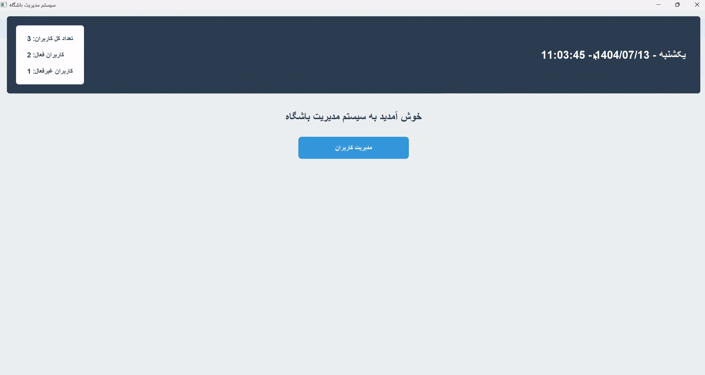

# Gym Users Management 💪🏋️‍♂️


  


A modern desktop app for managing gym users, built with PyQt5 and SQLite. Track memberships, renew subscriptions, and view stats with a Persian-friendly UI. Perfect for small fitness centers!

## Features ✨
- **User Management**: Add, update, delete, and search users by name or phone. 🔍
- **Subscription Handling**: 30-day subscriptions with auto-expiration checks and renewals. ⏰
- **Services Tracking**: Boolean flags for diet plans 🍎, training programs 🏃‍♂️, and coach assignments 👨‍🏫.
- **Jalali Calendar Support**: Display dates in Persian (Shamsi) format using jdatetime. 📅
- **UI Dashboard**: Home screen with welcome message, user stats (total/active/inactive), and real-time clock. 📊
- **Profile View**: Detailed user profiles with editable fields, checkboxes, and color-coded status (green for active, red for expired). ✅❌
- **Search & Filtering**: Real-time search in user table with highlighted expired rows. 🔴
- **Database**: Lightweight SQLite for storing user data (name, phone, program type: normal/vip, etc.). 🗄️
- **Styling**: Modern Fusion theme with custom colors, fonts, and responsive layouts. 🎨
- **Localization**: Right-to-left (RTL) support for Persian text and layouts. 🇮🇷


---
## "Gym User Management in Action 🏋️‍♂️👁️"




---

## Installation 🚀
Follow these steps to set up the project locally. Assumes you have Python 3.12+ installed.

```bash
# Step 1: Clone the repository
git clone https://github.com/MojtabaFotohi/gym-users-management.git
cd gym-users-management
```
```bash
# Step 2: Create and activate a virtual environment (recommended)
python -m venv venv
source venv/bin/activate  # On Windows: venv\Scripts\activate
```
```bash
# Step 3: Install dependencies from requirements.txt
pip install -r requirements.txt
```
```bash
# Step 4: Initialize the database (runs automatically on start, but you can run manually)
python gym.py  # This will create gym_management.db if it doesn't exist
```


**Note**: requirements.txt should include: `pyqt5`, `jdatetime`, `python-dateutil`. If missing, generate it with `pip freeze > requirements.txt`.

## Usage 📖
1. Launch the app: `python gym.py`  
2. From the home screen, click "Manage Users" to view/add/search users. 🏠  
3. Add users via the dialog: Enter name, phone, select program (normal/vip), check services. ➕  
4. View profiles: Double-click a table row to edit/renew/delete. ✏️  
5. Stats update in real-time in the header. 📈  
6. Search filters users instantly. ⚡  


## Contributing 🤝
Fork the repo, make changes, and submit a pull request. Issues and feature requests welcome!  

## License 📄
MIT License - Free to use and modify.  

Made with ❤️ by [MojtabaFotohi](https://github.com/MojtabaFotohi). Star the repo if you like it! ⭐
